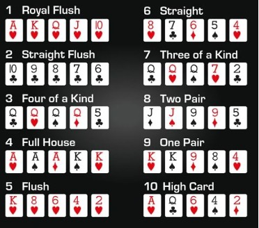

# Lab2: Poker

## How to play poker:

Each player gets dealt 5 cards. Each player decides which cards to keep, and which cards to replace. Players discard between 0-5 cards, and are dealt that same number of new cards. Players then show their hands to see who has the highest poker hand.


**Poker hands:**



| 1.  	| Royal Flush     	| The highest five cards, all in the same suite.          	|
|-----	|-----------------	|---------------------------------------------------------	|
| 2.  	| Straight Flush  	| Five cards in a sequence, all in the same suite.        	|
| 3.  	| Four of a Kind  	| All four cards of the same rank.                        	|
| 4.  	| Full House      	| Three of a kind with a pair.                            	|
| 5.  	| Flush           	| Any five cards of the same suit, but not in a sequence. 	|
| 6.  	| Straight        	| Five cards in a sequence, but not of the same suit.     	|
| 7.  	| Three of a kind 	| Three cards of the same rank.                           	|
| 8.  	| Two pair        	| Two different pairs.                                    	|
| 9.  	| Pair            	| Two cards of the same rank.                             	|
| 10. 	| High Card       	| Hand with the card of the highest rank                  	|


**Implementation:**

A card will be represented by an int from 1-52.

| Card 	| Suit 	| Face 	|   	|   	| Card 	| Suit 	| Face 	|
|------	|------	|------	|---	|---	|------	|------	|------	|
| 1    	| S    	| A    	|   	|   	| 27   	| C    	| A    	|
| 2    	| S    	| 2    	|   	|   	| 28   	| C    	| 2    	|
| ...  	|      	|      	|   	|   	| ...  	|      	|      	|
| 11   	| S    	| J    	|   	|   	| 37   	| C    	| J    	|
| 12   	| S    	| Q    	|   	|   	| 38   	| C    	| Q    	|
| 13   	| S    	| K    	|   	|   	| 39   	| C    	| K    	|
| 14   	| H    	| A    	|   	|   	| 40   	| D    	| A    	|
| 15   	| H    	| 2    	|   	|   	| 41   	| D    	| 2    	|
| ...  	|      	|      	|   	|   	| ...  	|      	|      	|
| 24   	| H    	| J    	|   	|   	| 50   	| D    	| J    	|
| 25   	| H    	| Q    	|   	|   	| 51   	| D    	| Q    	|
| 26   	| H    	| K    	|   	|   	| 52   	| D    	| K    	|


A deck will be represented by a 52 element int array.

**Task 1:** 
Create a function that takes an int card (1-52), and returns its face. 
You should return an int from 1-13 where: \
<pre> 1 = A, 2 = 2, 3 = 3, ... , 10 = 10, 11 = J, 12 = Q, 13 = K. </pre>

Tip: Must Use int / mod division.

`public static int face(int card)`
```java
public static int face(int card){
   //check if card is out of bounds
   if(card < 1 || card > 52){
       return 0;
   }
   //subtract 1 from card to include multiples of 13
   //add 1 so that it matches up with the desired output
   return (card - 1) % 13 + 1;
}

```

**Task 2:** Create a function that takes an int card (1-52), and returns its suit. You should return an int from 1-4 where:
<pre>1 = Spade, 2 = Heart, 3 = Clover, 4 = Diamond</pre>

Tip: Must Use int / mod division.

`public static int suit(int card)`

```java
public static int suit(int card){
   //check if card is out of bounds
   if(card < 1 || card > 52){
       return 0;
   }
   //subtract 1 from card to include multiples of 13
   //add 1 so that it matches up with the desired output
   return (card - 1) / 13 + 1;
}
```

**Task 3:** Create a function that takes an int card (1-52), and returns a nice looking String.

Use A, J, Q, K for face. Because we want cards to be 2 letters, the 10 presents a problem. Use X instead of 10. Ex, heart ace = &quot;HA&quot;, diamond king = &quot;DK&quot;, spade 3 = &quot;S3&quot;, clover 10 = &quot;CX&quot;

`public static String cardToString(int card)`

```java
public static String cardToString(int card){
   StringBuffer sb = new StringBuffer("");
   //add the suit of the card
   //convert the suit number into letter
   //create an array of suits
   String[] suits = {"S", "H", "C", "D"};
   sb.append(suits[suit(card) - 1]);
   //add the face of the card
   //convert 1, 10, 11, 12, 13 face numbers into letters
   //create an array of special faces
   String[] faces = {"X", "J", "Q", "K"};
   if(face(card) == 1){
       sb.append("A");
   } else if(face(card) >= 10){
       sb.append(faces[face(card) - 10]);
   } else {
       sb.append(face(card));
   }
   return sb.toString();
}
```

**Task 4:** Create a function that takes an int[] of cards, and returns a nice looking String. If the int[] is null, return &quot;[]&quot;. This function should be used for both decks (the stack of 52 cards you&#39;re playing with) and hands (each player&#39;s 5 cards).

Ex, `cardsToString({1,16,40}) => "[SA, H3, DA]"`

`public static String cardsToString(int[] cards)`
```java
public static String cardsToString(int[] cards){
   //check for null array
   if(cards == null){
       return "[]";
   }
   //string buffer with open brackets
   StringBuffer sb = new StringBuffer("[");
   //add the individual string cards to the string buffer
   for(int i = 0; i < cards.length; i++){
       sb.append(cardToString(cards[i]));
       //add a comma after all of the cards except the last one
       if(i != cards.length - 1){
           sb.append(", ");
       }
   }
   //add close bracket
   sb.append("]");
   return sb.toString();
}
```


**Task 5:** Create a function that takes a 52 element int[] of cards called deck, and shuffles it. Our shuffling algorithm will be as follows:

_Swap each card in the deck with another card at a random index. A card may be swapped with itself._

Because we are shuffling (changing) the deck itself, we don&#39;t need to return it.

`public static void shuffle(int[] deck)`
```java
public static void shuffle(int[] deck){
   //temporary variable for swapping the values
   int storage = 0;
   //random integer
   int randomInt;
   for(int i = 0; i < deck.length; i++){
       //set the variable equal to a random integer every time
       randomInt = (int) (Math.random() * (deck.length));
       //store the original deck[i] in storage
       //swap deck[i] and deck[randomInt]
       storage = deck[i];
       deck[i] = deck[randomInt];
       deck[randomInt] = storage;
   }
}
```


**Task 6:** Create a function that creates a 52 element shuffled int[] of cards.

`public static int[] createShuffledDeck()`
```java
public static int[] createShuffledDeck(){
   //create a deck
   int[] deck = new int[52];
   //make each item their respective index + 1 to avoid repetition
   for(int i = 0; i < deck.length; i++){
       deck[i] = i+1;
   }
   //shuffle deck
   shuffle(deck);
   return deck;
}
```

**Task 7:** Create a function that returns the next card in the deck. As we &quot;use&quot; cards, we should set their spot in the deck to 0 to represent empty. You should use cards in index order, meaning that as you&#39;re using cards, the deck with have 0&#39;s at the front. If you run out of cards in the deck, return 0.

`public static int nextCard(int[] deck)`
```java
public static int nextCard(int[] deck){
   int rv = 0;
   //go through deck looking for nonzero element
   for(int i = 0; i < deck.length; i++){
       if(deck[i] != 0){
           //set rv equal to first nonzero element
           rv = deck[i];
           //set that nonzero element to 0
           deck[i] = 0;
           break;
       }
   }
   return rv;
}
```

**Task 8:** Create a function called task8() and follow these steps:

1. Create a shuffled deck.
2. Print the deck.
3. Create a for loop that prints the first 5 cards in the deck, 1 card per line.
4. Look at the hand to determine its best poker value. Paste the output into the submission box, and indicate its best poker value as a comment.

`public static void task8()`

```java
public static void task8(){
   //Create a shuffled deck
   int[] deck = createShuffledDeck();
   //Print the deck
   System.out.println(cardsToString(deck));
   //Create a for loop that prints the first 5 cards in the deck, 1 card per line
   for(int i = 0; i < 5; i++){
       System.out.println(cardToString(deck[i]));
   }
}
```
<pre>OUTPUT:
[H2, S5, HA, SQ, DA, SX, H7, H9, H8, DK, S8, C7, H6, C5, C6, SA, D2, D9, DJ, S6, H5, HQ, C2, DX, CJ, S3, CK, CQ, D7, C8, C4, HX, S9, D4, C3, D6, S4, CX, D5, HK, CA, D8, S7, H3, C9, H4, HJ, D3, SJ, S2, DQ, SK]
H2
S5
HA
SQ
DA</pre>

**Task 9:** Create a function that takes a 5 element int[] of cards called hand, and returns its best poker hand using the values in the picture. You don&#39;t need to worry about the fact that a pair of 10&#39;s beats a pair of 9&#39;s, and we can just say that those 2 hands tie.

`public static int bestPokerHand(int[] hand)`
```java
public static void sort(int[] hand){
        for(int i=0; i<hand.length; i++){
            for (int j=i+1; j < hand.length; j++){
                if(hand[i] >= hand[j]){
                    int temp = hand[i];
                    hand[i] = hand[j];
                    hand[j] = temp;
                }
            }
        }
    }
    public static int bestPokerHand(int[] hand){
        //make sure hand has 5 cards
        if(hand.length != 5){
            return 0;
        }
        //sort hand
        sort(hand);

        //check the best poker hand
        if(isRoyalFlush(hand)){
            return 1;
        } else if(isStraightFlush(hand)){
            return 2;
        } else if(isFourOfAKind(hand)){
            return 3;
        } else if(isFullHouse(hand)){
            return 4;
        } else if(isFlush(hand)){
            return 5;
        } else if(isStraight(hand)){
            return 6;
        } else if(isThreeOfAKind(hand)){
            return 7;
        } else if(isTwoPair(hand)){
            return 8;
        } else if(isOnePair(hand)){
            return 9;
        } else {
            return 10;
        }
    }
    public static boolean isRoyalFlush(int[] hand){
        //return true if its a royal flush
        boolean royalFlush;
        //checks suit
        for(int i = 0; i < 4; i++){
            if(suit(hand[i]) == suit(hand[i+1])){
                royalFlush = true;
            } else {
                royalFlush = false;
                return royalFlush;
            }
        }
        //checks faces
        int[] royalFaces = {1, 10, 11, 12, 13};
        for(int i = 0; i < 5; i++){

        }
        return false;
    }
    public static boolean isStraightFlush(int[] hand){
        //return true if its a straight flush
        boolean straightFlush;
        //checks suit
        for(int i = 0; i < 4; i++){
            if(suit(hand[i]) == suit(hand[i+1])){
                straightFlush = true;
            } else {
                straightFlush = false;
                return straightFlush;
            }
        }
        //checks faces
        
        //TODO: implement
        return false;
    }
    public static boolean isFourOfAKind(int[] hand){
        //return true if its a four of a kind
        //TODO: implement
        return false;
    }
    public static boolean isFullHouse(int[] hand){
        //return true if its a full house
        //TODO: implement
        return false;
    }
    public static boolean isFlush(int[] hand){
        //return true if its a flush
        boolean flush = true;
        //checks suit
        for(int i = 0; i < 4; i++){
            if(suit(hand[i]) == suit(hand[i+1])){
                flush = true;
            } else {
                flush = false;
                return flush;
            }
        }
        return flush;
    }
    public static boolean isStraight(int[] hand){
        //return true if its a straight
        //TODO: implement
        return false;
    }
    public static boolean isThreeOfAKind(int[] hand){
        //return true if its a three of a kind
        //TODO: implement
        return false;
    }
    public static boolean isTwoPair(int[] hand){
        //return true if its a two pair
        //TODO: implement
        return false;
    }
    public static boolean isOnePair(int[] hand){
        //return true if its a one pair
        //TODO: implement
        return false;
    }
```

**Task 10:** Create a function that takes a poker hand called hand as an int from 1-10, and returns the name of that poker hand. Ex, pokerHand(1) =\&gt; &quot;Royal Flush. pokerHand(9) -\&gt; &quot;One Pair&quot;.

`public static String pokerHand(int hand)`
```java
public static String pokerHand(int hand){
   //define hand
   String[] names = {"Royal Flush", "Straight Flush", "Four of a Kind", "Full House", "Flush",
   "Straight", "Three of a Kind", "Two Pair", "One Pair", "High Card"};
   //check value of hand ranks
   if(hand > 0 && hand <= 10) {
       return names[hand - 1];
   } else {
       return null;
   }
}
```

**Task 11:** Create a play function that follows these steps:

1. Create a shuffled deck of 52 cards.
2. Create 2 5 element hands called handA, handB.
3. Deal cards into each hand in alternating order. IE, give a card to handA, give a card to handB, give a card to handA, etc... Yes, it must be alternating.
4. Display &quot;Player 1&#39;s turn&quot; and show them their hand.
5. Ask them which card they want to replace, using numbers 1-5. If they don&#39;t want to replace a card, they should type in 0.
6. Since users are allowed to replace more than 1 card, keep asking them this question until they enter 0.
7. Only after they&#39;ve indicated all the cards to replace, go through and replace those cards with new cards.
8. Display the new hand.
9. Repeat steps 4-8 for Player 2.
10. Determine the winner and print either &quot;Player 1 Wins!&quot; or &quot;Player 2 Wins!&quot;

`public static void play()`

```java

```
**Helper functions used:**

```java
public static String arrayToString(int[] a){
   //creates string with "{"
   StringBuffer rv = new StringBuffer("[");
   for(int i = 0; i < a.length; i++){
       //adds new item to string
       rv.append(a[i]);
       //if it is not at the last item, then add ", "
       if(i != a.length - 1){
           rv.append(",");
       }
   }
   //add "}"
   rv.append("]");
   return rv.toString();
}
```

```java
public static void testTask1() {
   for (int i = 1; i <= 52; i++){
       System.out.println("i = " + i + " Face= "+ face(i));
   }
}
```

```java
public static void testTask2(){
   for (int i = 1; i <= 52; i++){
       System.out.println("i = " + i + " Suit = "+ suit(i));
   }
}
```

```java
public static void testTask3(){
   for (int i = 1; i <= 52; i++){
       System.out.println("i = " + i + " Card = "+ cardToString(i));
   }
}
```
```java
public static void testTask4(){
   System.out.println("{1,16,40} = " + cardsToString(new int[] {1,16,40}));
}
```

```java
public static void testTask5(){
   int[] deck = new int[52];
   for(int i = 0; i < deck.length; i++){
       deck[i] = i+1;
   }
   System.out.println(arrayToString(deck));
   shuffle(deck);
   System.out.println(arrayToString(deck));
}
```
```java
public static void testTask6(){
   System.out.println(arrayToString(createShuffledDeck()));
}
```
```java
public static void testTask7(){
   int[] deck = new int[52];
   for(int i = 0; i < 52; i++){
       if(i < 15) {
           deck[i] = 0;
       } else {
           deck[i] = i;
       }
   }
   System.out.println(nextCard(deck));
}
```

